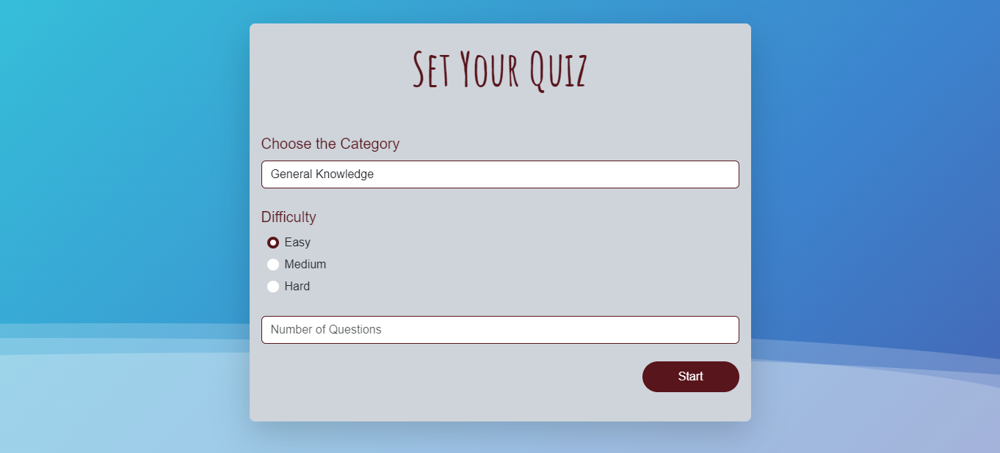
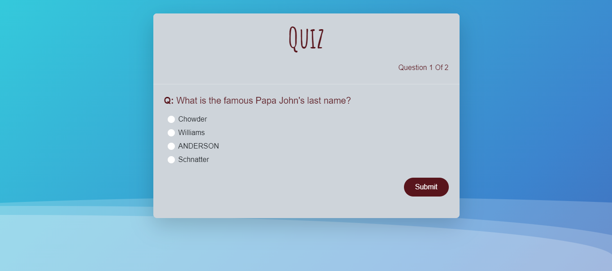

# Quiz Master

Quiz Master is a web application designed to test your knowledge with a variety of trivia questions. It uses the Open Trivia Database API to provide engaging and interactive quizzes.

## Features

- Interactive Quizzes: Test your knowledge with questions on various topics like history, sports, video games, and more, with different difficulty levels.
- Dynamic Filtering: Easily select quiz categories and difficulty settings to personalize your quiz experience.
- Responsive Design: Enjoy a seamless quiz experience on all devices, including desktops, tablets, and smartphones.

## Technologies Used

- HTML
- CSS
- Bootstrap
- JavaScript (with Modules and OOP)
- Open Trivia Database API (https://opentdb.com/api_config.php)

## Preview

## Live Demo

Check out the live demo [here]().

